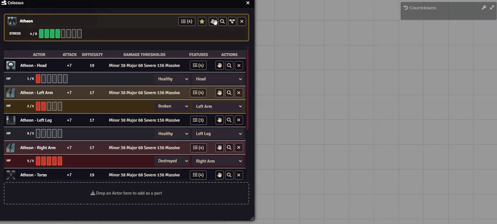
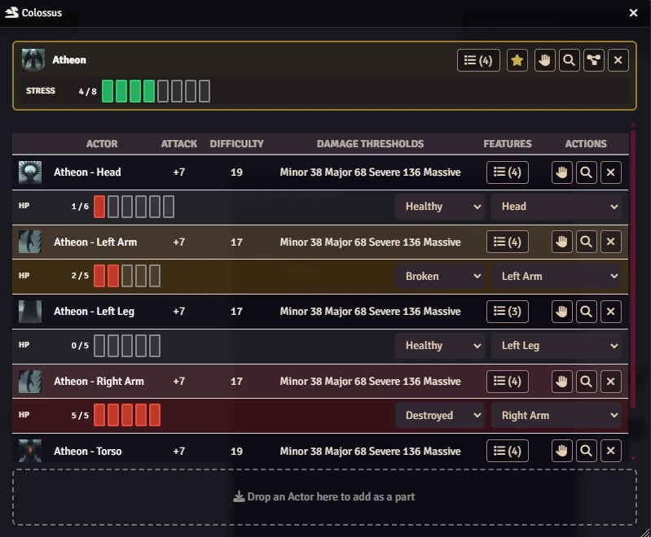
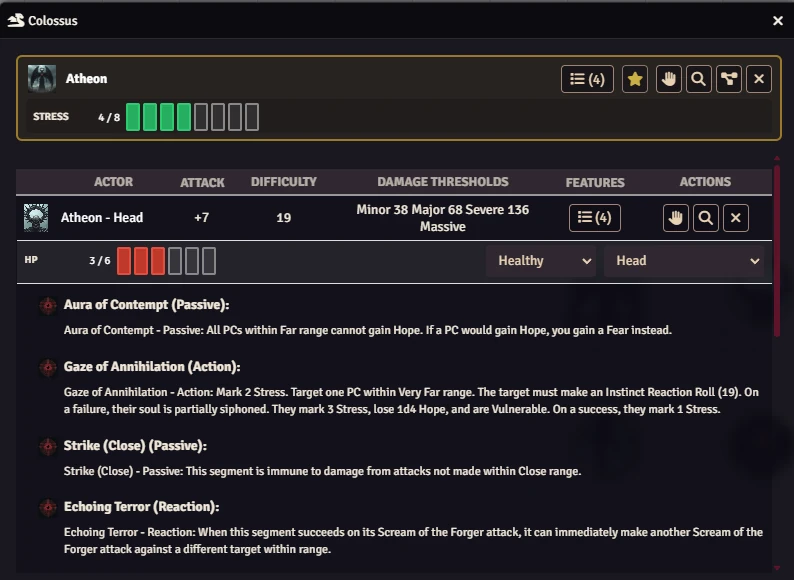
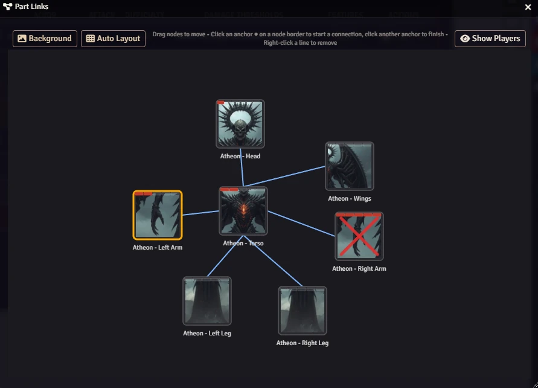
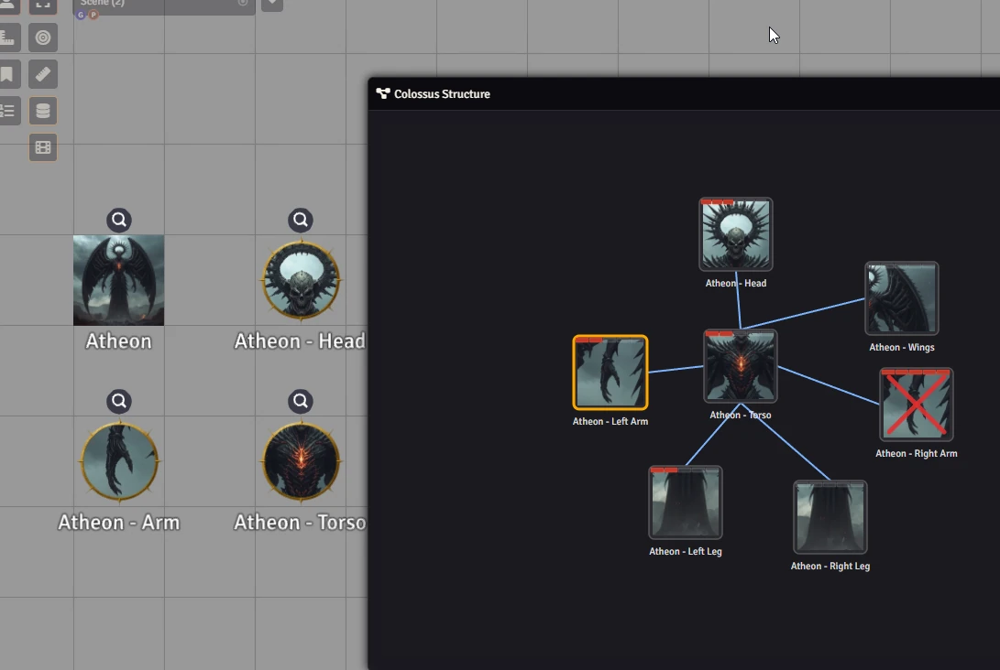
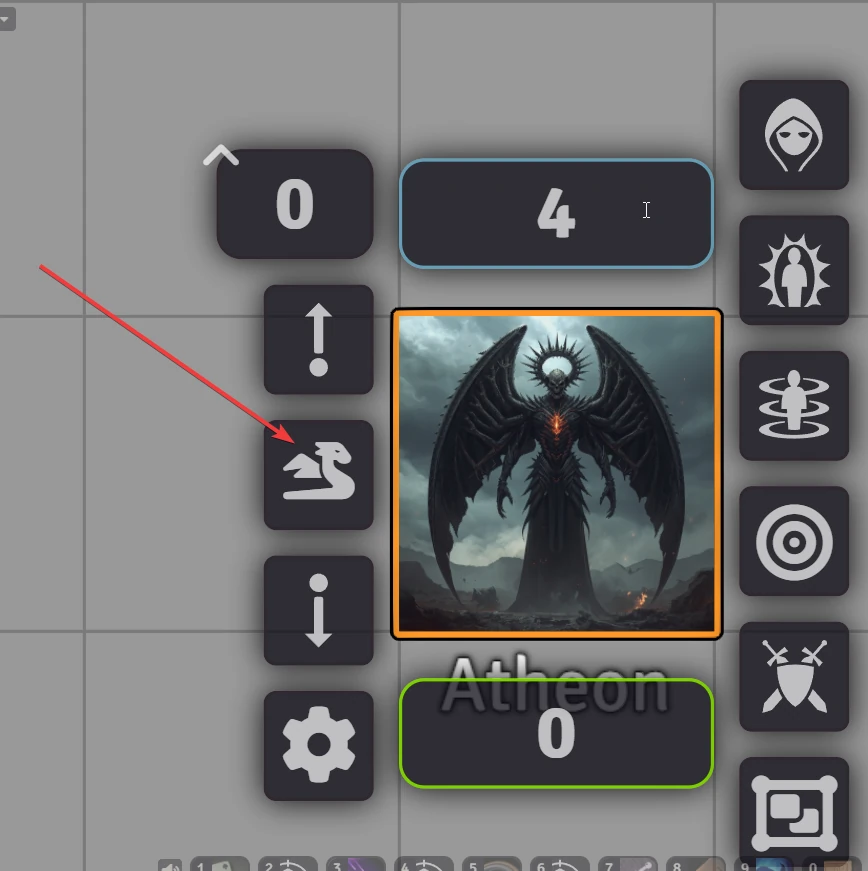
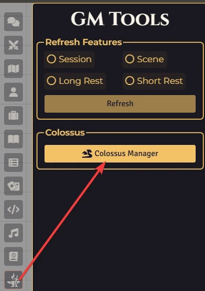

# Colossus — Daggerheart Module for Foundry VTT

Run **Colossus** encounters in Daggerheart — massive multi-part boss creatures where every limb, wing, and core is its own actor with its own HP and abilities.

<p align="center"></p>

[](https://buymeacoffee.com/mestredigital) [](https://mestredigital.online/pages/projetos-en)

---

## Why you need this

Running a Colossus by hand is painful. You have five or six separate actor sheets open at the same time, you lose track of which part is broken, and your players have no idea what they're looking at.

This module solves all of that in one window.

---

## What it does for you

**One sheet, everything in one place.**
Instead of juggling multiple actor sheets, you get a single Colossus Sheet that lists every part side by side — HP bars, attack bonuses, damage thresholds, and features. You can click any part to open its actor sheet if you need to.

<p align="center"></p>

<p align="center"></p>

**Live HP tracking with pip buttons.**
Click a pip to set HP. The sheet updates instantly across all connected players. No manual math, no typing numbers.

**Shared Stress.**
Stress belongs to the principal (the main body). Changing stress on any part of the Colossus changes it for the whole creature — there is only one shared stress pool.

**Part status at a glance.**
Each part can be marked as Healthy, Broken, or Destroyed. Broken parts turn amber, Destroyed parts turn red. When a part's HP fills up completely, it automatically flips to Destroyed so you never miss it mid-combat.

**Drag and drop setup.**
To build a Colossus, just drag your adversary actors onto the sheet. No forms to fill out. Drop the main body into the principal slot, drop the parts into the parts list, and you're ready.

**A visual map you can show your players.**
The Part Links editor lets you draw a diagram of how the Colossus parts connect to each other — arm connects to torso, torso connects to head, and so on. You can upload a background image (like a creature silhouette) and arrange the part cards on top of it. When you're ready, click **Show Players** and every connected player instantly sees the diagram on their screen.

**Gm View**
<p align="center"></p>

**Player View**
<p align="center"></p>

**Token HUD**
<p align="center"></p>


---

## Access and Macros

**Daggerheart Menu**
<p align="center"></p>

```js
Colossus.Manager();
```

```js
Colossus.Open(); // You must add the ID as arg
```

---

## 🚀 Installation

Install via the Foundry VTT Module browser or use this manifest link:

```js
https://raw.githubusercontent.com/brunocalado/dh-colossus/main/module.json
```

## 📜 Changelog

You can read the full history of changes in the [CHANGELOG](CHANGELOG.md).

## ⚖️ Credits and License

* **Code License:** [GNU GPLv3](LICENSE)

* **Legal Disclaimer:**  This module is an independent creation and is not an official Darrington Press product. This content is published under the Darrington Press Community Gaming License (DPCGL). The game mechanics contained herein are based on the Daggerheart system. This module does not contain any descriptive text, art, lore, or proprietary narratives from the official Daggerheart core rules or the Colossus of the Drylands campaign frame. All automations and rules implemented serve only as mechanical aids for the Foundry VTT platform. Daggerheart, the Daggerheart logo, and all related characters, names, and logos are trademarks of Darrington Press, LLC.

* **Images:** [link](https://www.pexels.com/pt-br/foto/halloween-na-church-street-31-outubro-de-2024-29706166/)

# 🧰 My Daggerheart Modules

| Module | Description |
| :--- | :--- |
| 💀 [**Adversary Manager**](https://github.com/brunocalado/daggerheart-advmanager) | Scale adversaries instantly and build balanced encounters. |
| 🖼️ [**Art Mapper**](https://github.com/brunocalado/dh-assets) | Automatically assigns artwork to system compendiums, actors, tokens, and custom module content — keeping your visuals organized and up to date. |
| 🐉 [**Colossus**](https://github.com/brunocalado/dh-colossus) | Manage massive multi-part boss encounters with independent HP per part and a single shared stress pool. |
| 📦 [**Containers**](https://github.com/brunocalado/dh-containers) | Group inventory items into collapsible containers — pouches, chests, backpacks — to declutter character sheets. |
| 💥 [**Critical**](https://github.com/brunocalado/daggerheart-critical) | Animated criticals. |
| 💠 [**Custom Stat Tracker**](https://github.com/brunocalado/dh-new-stat-tracker) | Add custom trackers to actors. |
| ☠️ [**Death Moves**](https://github.com/brunocalado/daggerheart-death-moves) | Enhances the Death Move moment with a dramatic interface and full automation. |
| 📏 [**Distances**](https://github.com/brunocalado/daggerheart-distances) | Visualizes combat ranges with customizable rings and hover calculations. |
| 📦 [**Extra Content**](https://github.com/brunocalado/daggerheart-extra-content) | Homebrew content pack. |
| 😱 [**Fear Tracker**](https://github.com/brunocalado/daggerheart-fear-tracker) | Adds an animated slider bar with configurable fear tokens to the UI. |
| 🧟 [**Horde**](https://github.com/brunocalado/dh-horde) | Explode single horde tokens into dozens of individual tokens and manage their movement and stats automatically. |
| 🎁 [**Mystery Box**](https://github.com/brunocalado/dh-mystery-box) | Introduces mystery box mechanics for random loot and surprises. |
| ⚡ [**Quick Actions**](https://github.com/brunocalado/daggerheart-quickactions) | Quick access to common mechanics like Falling Damage, Downtime, etc. |
| 📜 [**Quick Rules**](https://github.com/brunocalado/daggerheart-quickrules) | Fast and accessible reference guide for the core rules. |
| 🤖 [**Resource Macros**](https://github.com/brunocalado/daggerheart-fear-macros) | Automatically executes macros when the Fear, Hope, Stress, HP, or Armor resources change. |
| 🎲 [**Stats**](https://github.com/brunocalado/daggerheart-stats) | Tracks dice rolls from GM and Players. |
| 🧠 [**Stats Toolbox**](https://github.com/brunocalado/dh-statblock-importer) | Import actors using a statblock. |
| 🛒 [**Store**](https://github.com/brunocalado/daggerheart-store) | A dynamic, interactive, and fully configurable in-game store. |
| 🔍 [**Unidentified**](https://github.com/brunocalado/dh-unidentified) | Obfuscates item names and descriptions until they are identified by the players. |
| 🌌 [**Void**](https://github.com/brunocalado/the-void-unofficial) | Unofficial module that brings The Void playtesting content — experimental classes, subclasses, ancestries, communities, adversaries, loot, weapons, and more. |

# 🗺️ Adventures

| Adventure | Description |
| :--- | :--- |
| ✨ [**I Wish**](https://github.com/brunocalado/i-wish-daggerheart-adventure) | A wealthy merchant is cursed; one final expedition may be the only hope. |
| 💣 [**Suicide Squad**](https://github.com/brunocalado/suicide-squad-daggerheart-adventure) | Criminals forced to serve a ruthless master in a land on the brink of war. |